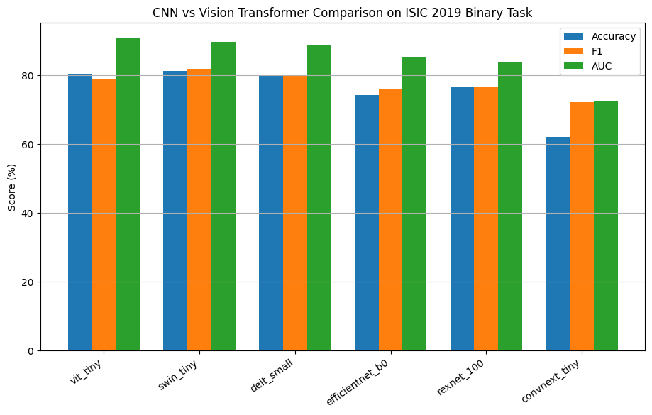
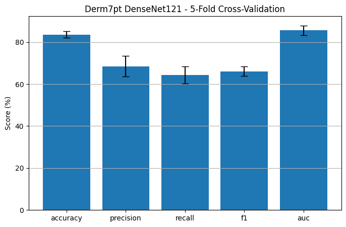
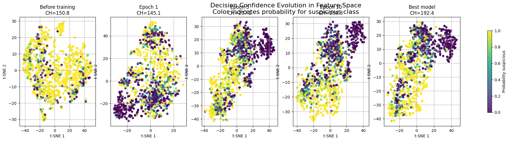
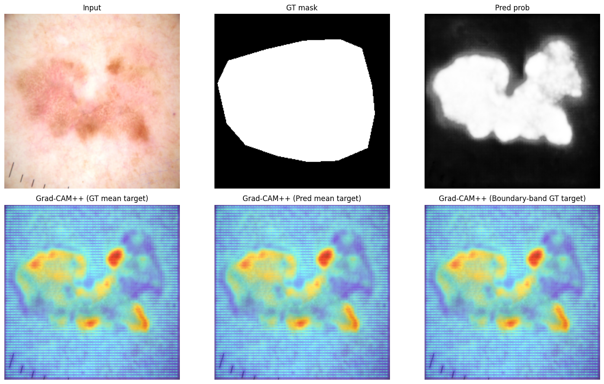

# Melanoma Classification and Explainability

Deep learning experiments for melanoma and skin lesion analysis, developed as part of a diploma thesis in the M.Sc. in Information Systems programme at the Hellenic Open University.

## Overview

This repository contains selected experiments from the diploma thesis:

**“Melanoma Recognition and Classification Using Transformers and Deep Learning Techniques.”**

The project investigates the use of convolutional neural networks, vision transformers, segmentation architectures and explainable artificial intelligence techniques for dermoscopic image analysis.

The main objectives are:

- Classification of melanoma and other skin lesions.
- Comparison of CNN and Transformer-based architectures.
- Skin lesion segmentation.
- Model evaluation under class imbalance.
- Interpretation of predictions using explainable AI.
- Feature-space and clustering analysis.
- Reproducible evaluation across multiple datasets.

## Repository Structure

```text
melanoma-classification-explainability/
├── notebooks/
│   ├── 01_cnn_vs_vision_transformer.ipynb
│   ├── 02_derm7pt_densenet121_cv_xai.ipynb
│   ├── 03_isic2019_efficientnetb0_feature_space.ipynb
│   └── 04_isic2016_vgg_unet_gradcam.ipynb
├── results/
│   ├── figures/
│   │   ├── cnn_vs_vit_comparison.png
│   │   ├── derm7pt_cross_validation_summary.png
│   │   ├── isic2019_feature_space_evolution.png
│   │   └── isic2016_vgg_unet_gradcam.png
│   └── README.md
├── .gitignore
├── requirements.txt
└── README.md
```

## Available Notebooks

| Notebook | Description |
|---|---|
| `01_cnn_vs_vision_transformer.ipynb` | Comparative evaluation of convolutional neural networks and Vision Transformer architectures. |
| `02_derm7pt_densenet121_cv_xai.ipynb` | DenseNet121 classification on Derm7pt using five-fold cross-validation and explainable AI. |
| `03_isic2019_efficientnetb0_feature_space.ipynb` | EfficientNet-B0 feature-space analysis on ISIC 2019, including dimensionality reduction and clustering evaluation. |
| `04_isic2016_vgg_unet_gradcam.ipynb` | VGG-U-Net skin lesion segmentation on ISIC 2016 with visual explanation analysis. |

## Datasets

The thesis investigates experiments using the following public skin lesion datasets:

- HAM10000
- ISIC 2016–2020
- PH2
- Derm7pt
- PAD-UFES-20
- SIIM-ISIC 2020

The datasets are not included in this repository because of their size and individual access or licensing requirements. Dataset paths must be configured locally or through Google Drive before running the notebooks.

## Models and Methods

The experiments include:

- ResNet
- DenseNet
- EfficientNet and EfficientNetV2
- ConvNeXt
- Vision Transformer
- Swin Transformer
- VGG-U-Net
- Transfer learning and fine-tuning
- Cross-validation
- Test-time augmentation
- Active learning
- Feature-space analysis

## Explainable AI

The thesis evaluates several explainability techniques, including:

- Grad-CAM
- Grad-CAM++
- Score-CAM
- Eigen-CAM
- Ablation-CAM
- Integrated Gradients
- DeepLIFT
- SHAP
- LIME
- Occlusion
- RISE

These methods are used to examine which image regions influence model predictions and to compare the behaviour of different architectures.

## Selected Thesis Results

| Experiment | Accuracy | F1-score | AUC |
|---|---:|---:|---:|
| HAM10000 binary classification – EfficientNet-B0 | 92.15% | 65.09% | 93.50% |
| HAM10000 multiclass classification – EfficientNetV2-S | 77.76% | 76.63% macro | 96.80% |
| PH2 binary classification – ConvNeXt-Tiny | 93.33% | 83.33% | 98.61% |

For the ISIC 2016 segmentation experiment, VGG-U-Net achieved:

- **Validation Dice:** 0.9051
- **Validation IoU:** 0.8330

Results correspond to the evaluation settings and dataset splits documented in the thesis.

## Selected Visual Results

### CNN vs Vision Transformer Comparison



### Derm7pt Five-Fold Cross-Validation



### ISIC 2019 Feature-Space Evolution



### ISIC 2016 VGG-U-Net Explainability



Dataset attribution, licensing information and figure descriptions are documented in [`results/README.md`](results/README.md).

## Installation

Clone the repository:

```bash
git clone https://github.com/Alekosbis/melanoma-classification-explainability.git
cd melanoma-classification-explainability
```

Create and activate a virtual environment:

```bash
python -m venv .venv
source .venv/bin/activate
```

Install the required libraries:

```bash
pip install -r requirements.txt
```

The notebooks can be opened in a local Jupyter environment or uploaded and executed through Google Colab.

## Reproducibility

The experiments document:

- Dataset preparation and preprocessing.
- Training, validation and test splits.
- Random seed configuration.
- Model training parameters.
- Evaluation metrics.
- Explainability procedures.

Local dataset and Google Drive paths may need to be adjusted before execution. Large datasets and trained model checkpoints are not stored in this repository.

## Disclaimer

This repository is intended exclusively for research and educational purposes. The models and results presented here are not medical devices and must not be used for clinical diagnosis or treatment decisions.

## Author

**Alexandros Bistolas**

Electronic Engineer  
M.Sc. in Information Systems  
Hellenic Open University

GitHub: [Alekosbis](https://github.com/Alekosbis)
