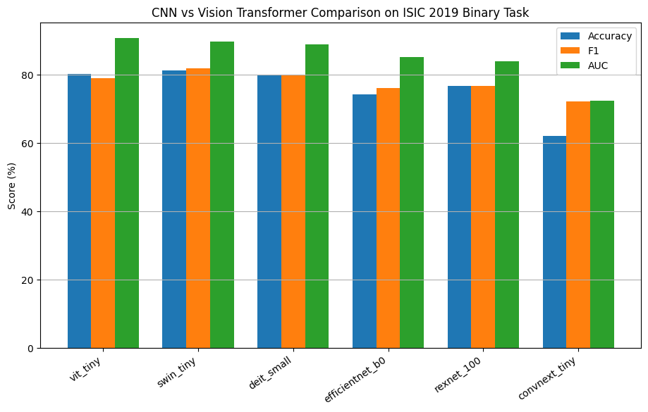
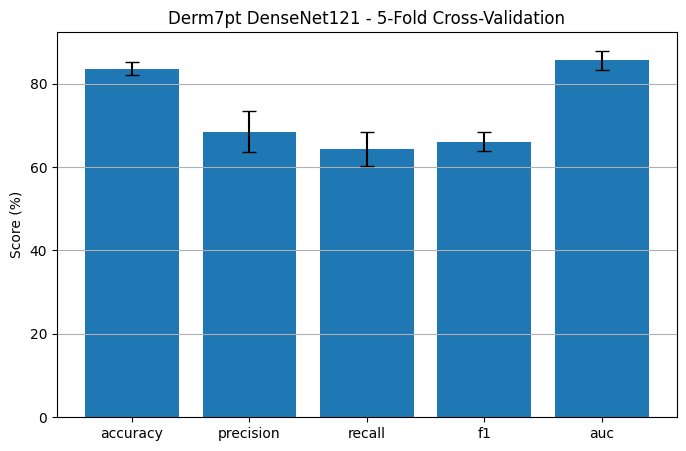
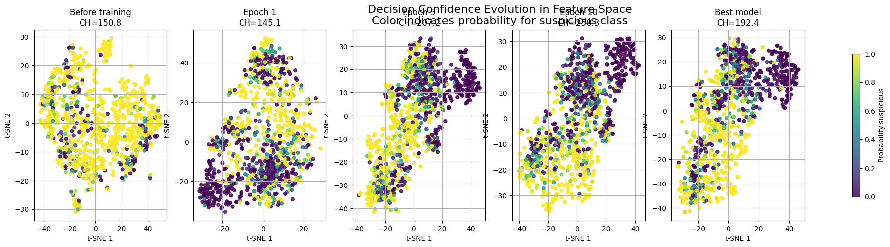
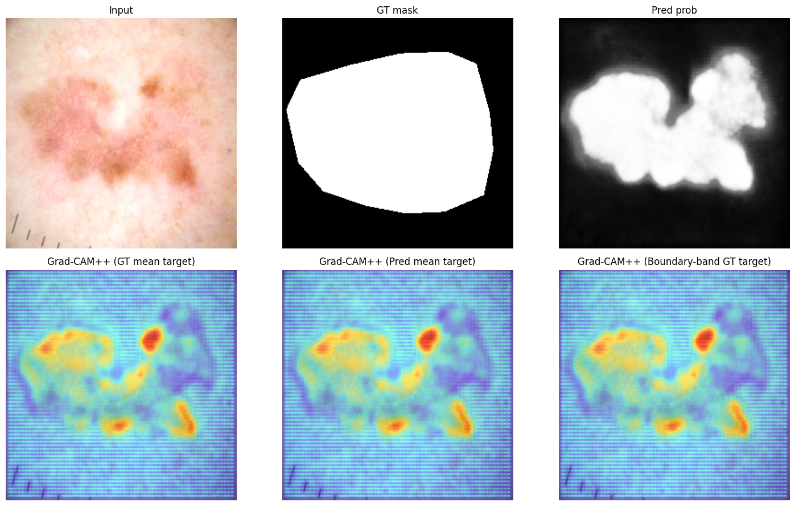
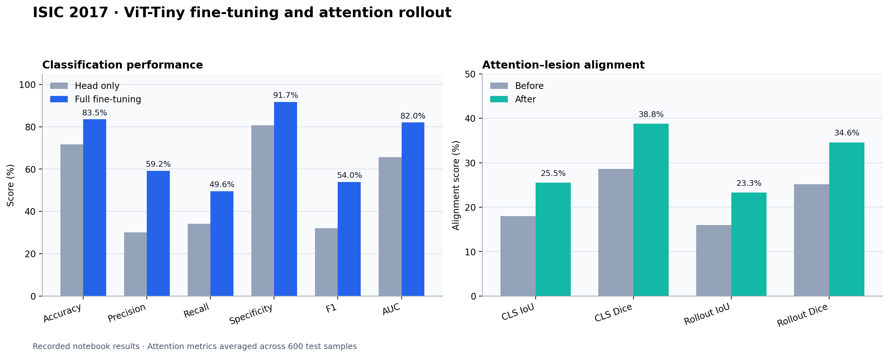
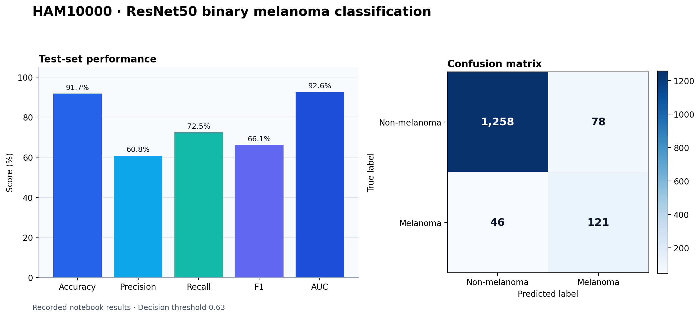

# Selected Visual Results

This directory contains representative figures exported from the experiment notebooks or generated from their recorded aggregate results. The figures are included to make the main findings easier to inspect without executing the complete training pipelines.

## Figures

### CNN vs Vision Transformer Comparison

Aggregate accuracy, F1-score and AUC comparison for CNN and Transformer-based models on the ISIC 2019 binary classification task.

### Derm7pt Five-Fold Cross-Validation

Mean classification performance with fold-to-fold variability for DenseNet121 on Derm7pt.

### ISIC 2019 Feature-Space Evolution

Evolution of the learned feature space from the untrained representation to the selected model, visualised using t-SNE and coloured by predicted probability.

### ISIC 2016 VGG-U-Net Explainability

Input image, ground-truth mask, predicted probability map and Grad-CAM++ explanations for different segmentation targets.

### ISIC 2017 ViT-Tiny Fine-Tuning and Attention Rollout

Comparison of head-only and fully fine-tuned classification performance, together with before-and-after attention-to-lesion alignment for last-layer CLS attention and attention rollout.

### HAM10000 ResNet50 Classification and XAI

Recorded test-set metrics and confusion matrix for the ResNet50 binary melanoma classifier at the selected validation threshold.

## Data Attribution and Licensing

### ISIC 2017 and HAM10000 Aggregate Figures

The ISIC 2017 and HAM10000 figures contain aggregate experimental metrics only and do not redistribute original clinical or dermoscopic images. Dataset access and citation information is available through the [official ISIC Challenge dataset page](https://challenge.isic-archive.com/data/).

Relevant references are included below in the ISIC 2019 section.

### ISIC 2019

The ISIC 2019 training dataset is distributed under the [Creative Commons Attribution-NonCommercial 4.0 International License](https://creativecommons.org/licenses/by-nc/4.0/). The aggregate dataset includes data from BCN_20000, HAM10000 and MSK. Required attribution and citation information is available on the [official ISIC Challenge dataset page](https://challenge.isic-archive.com/data/).

Relevant references include:

- Tschandl, P., Rosendahl, C. and Kittler, H. “The HAM10000 dataset, a large collection of multi-source dermatoscopic images of common pigmented skin lesions.” *Scientific Data*, 5, 180161, 2018.
- Codella, N. C. F. et al. “Skin Lesion Analysis Toward Melanoma Detection: A Challenge at the 2017 International Symposium on Biomedical Imaging.” arXiv:1710.05006.
- Hernández-Pérez, C. et al. “BCN20000: Dermoscopic lesions in the wild.” *Scientific Data*, 11, 641, 2024.

### ISIC 2016

The ISIC 2016 challenge dataset is listed as [CC0](https://creativecommons.org/publicdomain/zero/1.0/) on the [official ISIC Challenge dataset page](https://challenge.isic-archive.com/data/).

Reference:

- Gutman, D. et al. “Skin Lesion Analysis toward Melanoma Detection: A Challenge at the International Symposium on Biomedical Imaging (ISBI) 2016, hosted by the International Skin Imaging Collaboration.” arXiv:1605.01397, 2016.

### Derm7pt

The Derm7pt figure in this directory contains aggregate experimental metrics only and does not redistribute original clinical or dermoscopic images.

Reference:

- Kawahara, J., Daneshvar, S., Argenziano, G. and Hamarneh, G. “Seven-Point Checklist and Skin Lesion Classification Using Multitask Multimodal Neural Nets.” *IEEE Journal of Biomedical and Health Informatics*, 23(2), 538–546, 2019.

## Disclaimer

These figures are provided exclusively for research and educational purposes. They must not be used for clinical diagnosis or treatment decisions.
